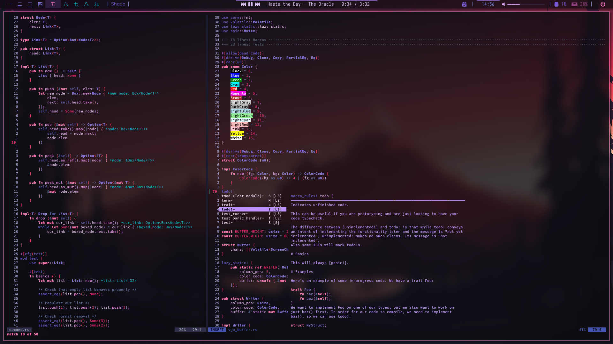
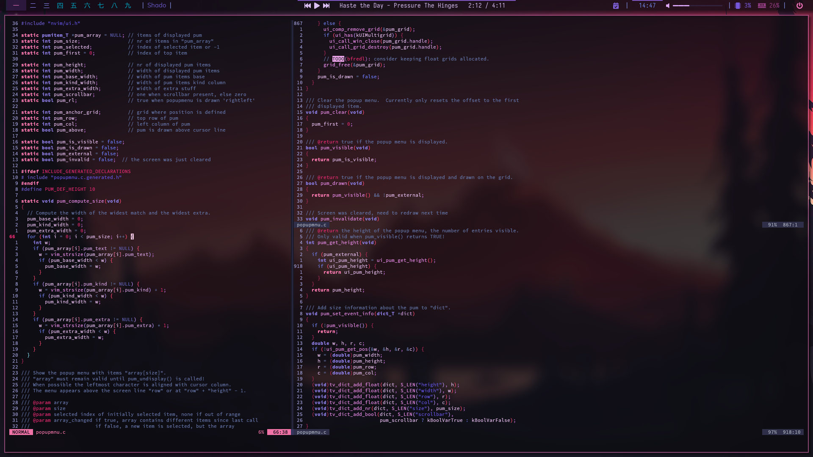

shadovim
==========

A neovim setup for the shadow warriors. Speed through the light with the
power of shadovim built on the new Lua based neovim! With the highly
overpowered native LSP, built in auto-completion, snippets, menus and so
much more, you will unleash the power of a hundred million shadows!

Installation
==============

Installing shadovim is relatively simple. Make sure you have Nvim v0.5.0
or higher (install and build from nightly source).

Simply clone the repository, change directory to it, give the setup script
execute permissions, and run it and it will setup shadovim no problem!
It is well documented and has error checking as well to make sure you know
what happened if it errors.

```bash
❱  git clone https://github.com/Shadorain/shadovim ~/.config/nvim
❱  cd ~/.config/nvim/
❱  chmod +x ./setup
❱  ./setup
```

General Content
=================

Shadovim has a very simple file tree, the main content is handled in the
`lua/` directory:

```bash
.
├── init.lua             # All initializing and sourcing
└── lua
    ├── binds.lua        # Any keybinds
    ├── config.lua       # General and plugin configuration settings
    ├── lsp_config.lua   # Configures general lsp and extra lsp based plugins
    └── plugins.lua      # Packer setup and plugin defining
```

All snippets can be added in the `snips/` directory. Any syntax files in
the `syntax/` directory.

Finished
=============

Here are some cool screenshots of it in action!




You now have a fully setup Shadovim configuration! With shadotheme and
a bunch of other cool perks under your sleeves! To see all the power it has
there is no better way that to read the source, it is all in there!

I hope you enjoy!
