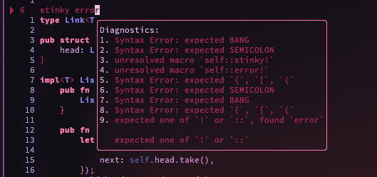
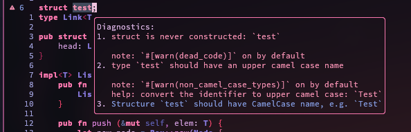
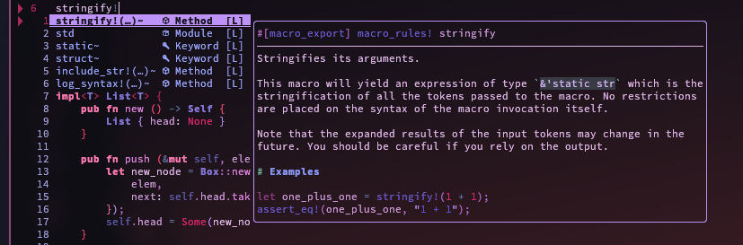
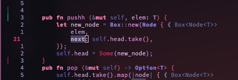
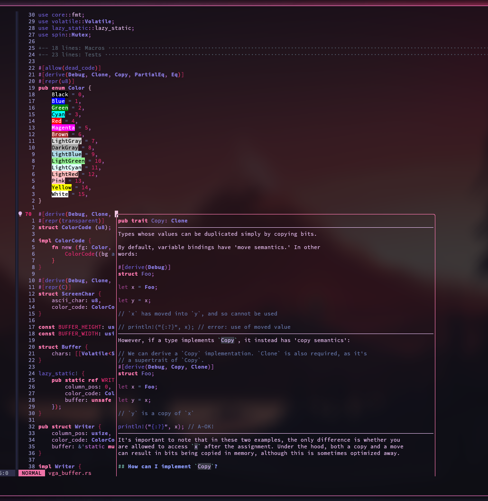
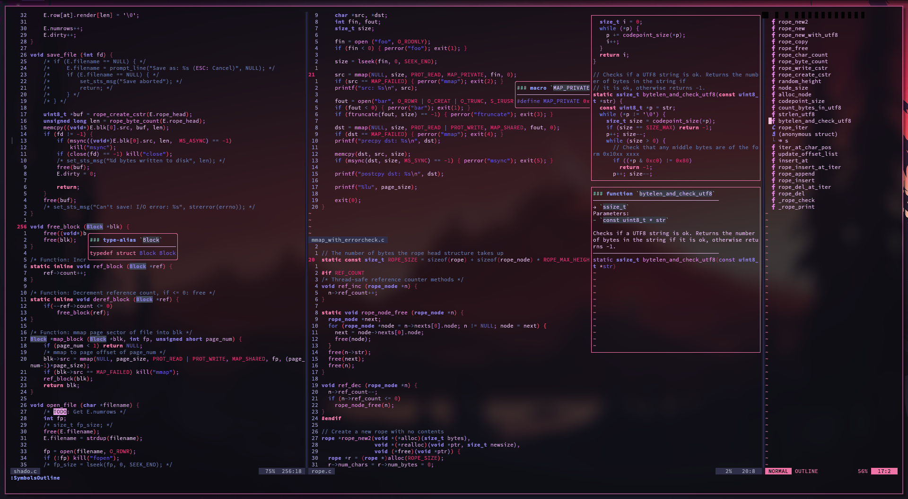

shadovim
==========

A neovim setup for the shadow warriors. Speed through the light with the
power of shadovim built on the new Lua based neovim! With the highly
overpowered native LSP, built in auto-completion, snippets, menus and so
much more, you will unleash the power of a hundred million shadows!

> P.S: even I am shocked by how absolutely fast the LSP, completion,
>  and startup is. Threw me for a wonderful surprise!

Installation
==============

Installing shadovim is relatively simple. Make sure you have Nvim v0.5.0
or higher (install and build from nightly source).

Simply clone the repository, change directory to it, give the setup script
execute permissions, and run it and it will setup shadovim no problem!
It is well documented and has error checking as well to make sure you know
what happened if it errors.

```bash
❱  git clone https://github.com/Shadorain/shadovim ~/.config/nvim
❱  cd ~/.config/nvim/
❱  chmod +x ./setup
❱  ./setup
```

General Content
=================

Shadovim has a very simple file tree, the main content is handled in the
`lua/` directory:

```bash
.
├── init.lua             # All initializing and sourcing
└── lua
    ├── binds.lua        # Any keybinds
    ├── config.lua       # General and plugin configuration settings
    ├── lsp_config.lua   # Configures general lsp and extra lsp based plugins
    └── plugins.lua      # Packer setup and plugin defining
```

All snippets can be added in the `snips/` directory. Any syntax files in
the `syntax/` directory.

Show off
=============

Here are some cool screenshots of it in action!

### Lsp Errors

Colors the text inside the popup window with red for error and pink for warning,
with proper symbols on the side. Hints get shown in the windows as well if any
exist!




### Completion

Full autocompletion menu with icons and descriptors for the source where the
completion is coming from, and special documentation blocks that are fully
configurable to explain the completion entry!



### Git Signs

Track your changes with git indicators on the side. [ Green:Add, Blue:Change,
Red:Delete].



### Hover Documents & Colorizer

Colorizer that highlights the colors in the text with the color written.
Hover menu for documentation and whatever else!



### Symbol Outline

An in depth symbol analysis of the file, with previews, keybinds and many
more options.

> This is a C file. Works in all filetypes with lsp support too!



You now have a fully setup Shadovim configuration! With shadotheme and
a bunch of other cool perks under your sleeves! To see all the power it has
there is no better way that to read the source, it is all in there!

I hope you enjoy! God bless 😊
